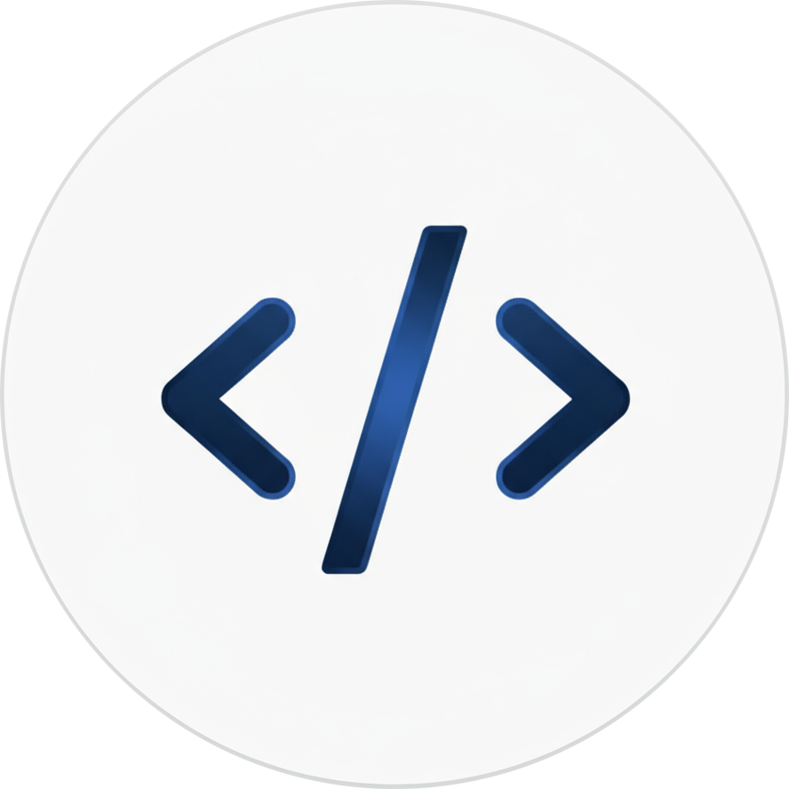

# API Studio Documentation Branch

<div align="center">
  
  <h3>Documentation Source Files</h3>
  <p><em>This is the <code>gh-pages</code> branch containing MkDocs documentation source files</em></p>
  
  <p>
    <a href="https://lusan-sapkota.github.io/Api-Studio/">🌐 View Live Documentation</a> •
    <a href="https://github.com/Lusan-sapkota/Api-Studio/tree/main">Back to Main Repository</a>
  </p>

  <p>
    
    
    
  </p>
</div>

---

## About This Branch

This `gh-pages` branch contains the **documentation source files** for API Studio, built with [MkDocs](https://www.mkdocs.org/) and [Material for MkDocs](https://squidfunk.github.io/mkdocs-material/).

**� Live Docyumentation:** [lusan-sapkota.github.io/Api-Studio](https://lusan-sapkota.github.io/Api-Studio/)

## Structure

```
├── src/                    # Documentation source files
│   ├── index.md           # Homepage
│   ├── getting-started/   # Installation & setup guides
│   ├── api-clients/       # API client documentation
│   ├── features/          # Feature guides
│   ├── development/       # Contributing & development
│   └── assets/           # Images and static files
├── mkdocs.yml            # MkDocs configuration
├── requirements-docs.txt # Python dependencies
└── .github/workflows/    # GitHub Actions for deployment
```

## Local Development

To work on the documentation locally:

```bash
# Clone this branch
git clone -b gh-pages https://github.com/Lusan-sapkota/Api-Studio.git
cd Api-Studio

# Set up Python environment
python -m venv .venv
source .venv/bin/activate  # On Windows: .venv\Scripts\activate

# Install dependencies
pip install -r requirements-docs.txt

# Serve locally
mkdocs serve
```

The documentation will be available at `http://localhost:8000/Api-Studio/`

## Deployment

Documentation is automatically deployed via **GitHub Actions** when changes are pushed to this branch:

- **Trigger:** Push to `gh-pages` branch
- **Build:** MkDocs generates static HTML
- **Deploy:** GitHub Pages serves the built site
- **URL:** https://lusan-sapkota.github.io/Api-Studio/

## Contributing to Documentation

1. **Edit files** in the `src/` directory
2. **Test locally** with `mkdocs serve`
3. **Commit and push** to `gh-pages` branch
4. **GitHub Actions** will automatically deploy changes

## Related Links

- **Main Repository:** [github.com/Lusan-sapkota/Api-Studio](https://github.com/Lusan-sapkota/Api-Studio)
- **Live Documentation:** [lusan-sapkota.github.io/Api-Studio](https://lusan-sapkota.github.io/Api-Studio/)
- **Issues & Feedback:** [GitHub Issues](https://github.com/Lusan-sapkota/Api-Studio/issues)

---

<div align="center">
  <p><strong>Note:</strong> For the main API Studio application code, visit the <a href="https://github.com/Lusan-sapkota/Api-Studio/tree/main"><code>main</code> branch</a></p>
</div>
