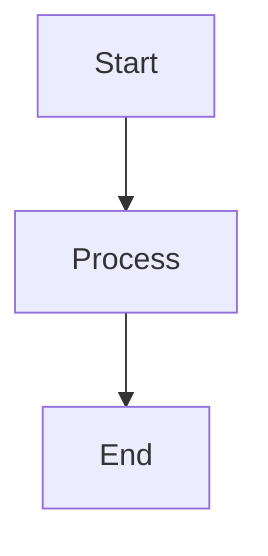

# Documentation Deployment Guide

This guide explains how to deploy the API Studio documentation to GitHub Pages.

## Prerequisites

1. **GitHub Repository**: Your repository should be public or have GitHub Pages enabled
2. **Logo File**: Place your `logo.png` in the `docs/assets/` directory
3. **MkDocs**: Install MkDocs and dependencies locally for testing

## Local Development

### Setup

1. **Install Dependencies**:

   ```bash
   pip install -r requirements-docs.txt
   ```

2. **Add Logo**:

   ```bash
   # Copy your logo to the assets directory
   cp /path/to/your/logo.png docs/assets/logo.png
   ```

3. **Serve Locally**:

   ```bash
   # Use the provided script
   ./docs-serve.sh

   # Or run MkDocs directly
   mkdocs serve --dev-addr=localhost:8001
   ```

4. **View Documentation**:
   Open http://localhost:8001 in your browser

### Making Changes

1. **Edit Markdown Files**: Modify files in the `docs/` directory
2. **Update Navigation**: Edit `mkdocs.yml` to add/remove pages
3. **Test Locally**: Changes are reflected automatically with live reload
4. **Commit Changes**: Commit your changes to the repository

## GitHub Pages Deployment

### Automatic Deployment

The repository includes a GitHub Actions workflow that automatically deploys documentation:

1. **Trigger**: Pushes to `main` branch that modify documentation files
2. **Build**: GitHub Actions builds the documentation using MkDocs
3. **Deploy**: Automatically deploys to GitHub Pages

### Manual Setup

If you need to set up GitHub Pages manually:

1. **Repository Settings**:

   - Go to your repository on GitHub
   - Click "Settings" tab
   - Scroll to "Pages" section

2. **Source Configuration**:

   - Source: "GitHub Actions"
   - The workflow will handle the rest

3. **Enable Pages**:
   - Save the settings
   - GitHub will provide your documentation URL

### Workflow Configuration

The deployment workflow (`.github/workflows/docs.yml`) includes:

- **Trigger Conditions**: Runs on pushes to main branch
- **Python Setup**: Installs Python and MkDocs dependencies
- **Build Process**: Builds documentation with MkDocs
- **Deployment**: Deploys to GitHub Pages using official actions

## Customization

### Theme Configuration

Edit `mkdocs.yml` to customize the theme:

```yaml
theme:
  name: material
  palette:
    primary: indigo # Change primary color
    accent: indigo # Change accent color
  logo: assets/logo.png
  favicon: assets/logo.png
```

### Navigation Structure

Update the navigation in `mkdocs.yml`:

```yaml
nav:
  - Home: index.md
  - Getting Started:
      - Installation: getting-started/installation.md
      - Quick Start: getting-started/quick-start.md
  # Add more sections as needed
```

### Custom CSS

Add custom styles by creating `docs/stylesheets/extra.css`:

```css
:root {
  --md-primary-fg-color: #4f46e5;
  --md-accent-fg-color: #4f46e5;
}
```

Then reference it in `mkdocs.yml`:

```yaml
extra_css:
  - stylesheets/extra.css
```

## Content Guidelines

### Writing Style

- **Clear and Concise**: Use simple, direct language
- **Code Examples**: Include practical examples
- **Screenshots**: Add screenshots for UI elements (when available)
- **Cross-references**: Link between related sections

### Markdown Features

The documentation supports advanced Markdown features:

#### Admonitions

```markdown
!!! tip "Pro Tip"
This is a helpful tip for users.

!!! warning "Important"
This is important information.

!!! note "Note"
This is additional information.
```

#### Code Blocks with Syntax Highlighting

````markdown
```python
def hello_world():
    print("Hello, World!")
```
````

````

#### Tabs

```markdown
=== "Python"
    ```python
    print("Hello from Python")
    ```

=== "JavaScript"
    ```javascript
    console.log("Hello from JavaScript");
    ```
````

#### Mermaid Diagrams

````markdown

````

````

## Maintenance

### Regular Updates

1. **Keep Dependencies Updated**: Regularly update MkDocs and plugins
2. **Review Content**: Ensure documentation stays current with the application
3. **Check Links**: Verify internal and external links work correctly
4. **Monitor Analytics**: Use GitHub Pages analytics to understand usage

### Version Management

Consider using version tags for major releases:

```bash
# Tag a release
git tag -a v1.0.0 -m "Version 1.0.0 documentation"
git push origin v1.0.0
````

### Backup

The documentation is version-controlled with Git, but consider:

1. **Regular Commits**: Commit changes frequently
2. **Branch Protection**: Protect the main branch
3. **Multiple Contributors**: Set up proper access controls

## Troubleshooting

### Common Issues

=== "Build Failures"

    **Problem**: GitHub Actions build fails

    **Solutions**:
    - Check the Actions tab for error details
    - Verify all markdown files are valid
    - Ensure all referenced files exist

=== "Missing Images"

    **Problem**: Images don't display

    **Solutions**:
    - Check file paths are correct
    - Ensure images are in the `docs/assets/` directory
    - Verify image file names match references

=== "Navigation Issues"

    **Problem**: Pages don't appear in navigation

    **Solutions**:
    - Check `mkdocs.yml` navigation structure
    - Ensure file paths are correct
    - Verify markdown files exist

### Getting Help

If you encounter deployment issues:

1. **Check GitHub Actions**: Review the workflow logs
2. **Test Locally**: Ensure the site builds locally
3. **GitHub Support**: Contact GitHub support for Pages issues
4. **Community**: Ask in the MkDocs community forums

## Next Steps

1. **Add Your Logo**: Place your logo.png in docs/assets/
2. **Customize Content**: Update the documentation content
3. **Test Locally**: Use `./docs-serve.sh` to test changes
4. **Deploy**: Push changes to trigger automatic deployment
5. **Share**: Share your documentation URL with users
