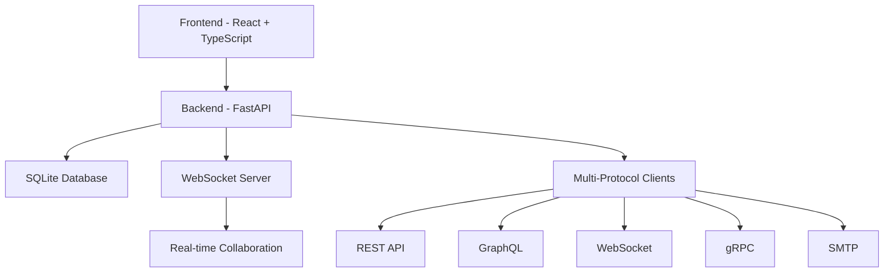

# Welcome to API Studio

<div align="center">
  
  <h2>A self-hosted, local-first alternative to Postman</h2>
  <p><em>"If Postman was built like VS Code — lightweight, local, and lightning-fast."</em></p>
  
  <div style="margin: 20px 0;">
    <span style="background: #3B82F6; color: white; padding: 4px 12px; border-radius: 16px; font-size: 0.85em; font-weight: 500;">
      Active Development
    </span>
  </div>
</div>

---

## What is API Studio?

API Studio is a comprehensive developer tool for API exploration, testing, and documentation. Built with privacy and performance in mind - no cloud dependency, no data collection, no paywalls.

### Key Features

=== "Multi-Protocol Support"

    Test APIs across multiple protocols with specialized clients:
    
    - **REST Client** - Full HTTP method support
    - **GraphQL Studio** - Schema introspection and query building
    - **WebSocket Playground** - Real-time connections
    - **gRPC Explorer** - Service discovery and streaming
    - **SMTP Tester** - Email composition and testing

=== "Privacy First"

    Your data stays on your machine:
    
    - **Local-first architecture** - No cloud dependency
    - **No tracking** - Zero data collection
    - **Self-hosted** - Complete control over your data
    - **Open source** - Transparent and auditable

=== "Lightning Fast"

    Built for speed and efficiency:
    
    - **Modern web technologies** - No Electron bloat
    - **Real-time collaboration** - WebSocket-powered
    - **Smart caching** - Instant response times
    - **Optimized UI** - Smooth interactions

=== "Developer Friendly"

    Designed by developers, for developers:
    
    - **Intuitive interface** - Easy to learn and use
    - **Powerful features** - Advanced testing capabilities
    - **Extensible** - Plugin system (coming soon)
    - **Well documented** - Comprehensive guides

## Quick Start

Get up and running in minutes:

```bash
# Clone the repository
git clone https://github.com/Lusan-sapkota/Api-Studio.git
cd api-studio

# Run the setup script
chmod +x setup.sh
./setup.sh
```

!!! tip "Automated Setup"
    The setup script will automatically install all dependencies and configure the environment for you.

## Architecture Overview



## Why API Studio?

### The Problem

Existing API testing tools have significant limitations:

- **Privacy concerns** - Your API data is sent to third-party servers
- **Performance issues** - Heavy Electron apps that consume resources
- **Vendor lock-in** - Proprietary formats and cloud dependencies
- **Limited protocols** - Most tools focus only on REST APIs
- **Collaboration barriers** - Expensive team plans and sharing limitations

### The Solution

API Studio addresses these issues with:

- **Local-first approach** - Everything runs on your machine
- **Modern web architecture** - Fast, responsive, and lightweight
- **Open source** - No vendor lock-in, community-driven development
- **Multi-protocol support** - Test any type of API from one interface
- **Built-in collaboration** - Real-time sharing without external dependencies

## What's Next?

<div class="grid cards" markdown>

-   :material-rocket-launch:{ .lg .middle } **Get Started**

    ---

    Install API Studio and start testing your APIs in minutes

    [:octicons-arrow-right-24: Installation Guide](getting-started/installation.md)

-   :material-api:{ .lg .middle } **API Clients**

    ---

    Explore the different protocol clients and their capabilities

    [:octicons-arrow-right-24: API Clients Overview](api-clients/overview.md)

-   :material-cog:{ .lg .middle } **Features**

    ---

    Learn about collections, environments, and collaboration features

    [:octicons-arrow-right-24: Features Guide](features/collections.md)

-   :material-code-braces:{ .lg .middle } **Development**

    ---

    Contribute to the project or extend its functionality

    [:octicons-arrow-right-24: Contributing Guide](development/contributing.md)

</div>

## Community & Support

- **GitHub Repository**: [Lusan-sapkota/Api-Studio](https://github.com/Lusan-sapkota/Api-Studio)
- **Issues & Bug Reports**: [GitHub Issues](https://github.com/Lusan-sapkota/Api-Studio/issues)
- **Email Support**: [sapkotalusan@gmail.com](mailto:sapkotalusan@gmail.com)

---

<div align="center">
  <p>Made with ❤️ by <a href="https://github.com/Lusan-sapkota">Lusan Sapkota</a></p>
  <p><small>Licensed under AGPL-3.0 | <a href="https://github.com/Lusan-sapkota/Api-Studio/blob/main/LICENSE">View License</a></small></p>
</div>