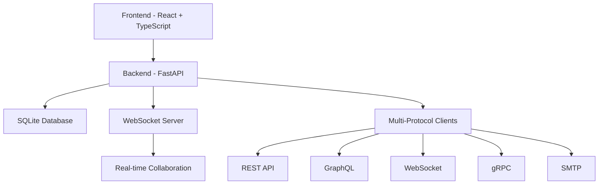

# Architecture

API Studio follows a modern, scalable architecture designed for performance and maintainability.

## System Overview

## Frontend Architecture

### Technology Stack
- **React 18**: Modern React with hooks and concurrent features
- **TypeScript**: Type-safe development
- **Tailwind CSS**: Utility-first styling
- **Vite**: Fast build tool and dev server

### Component Structure
- **Pages**: Route-level components
- **Components**: Reusable UI components
- **Layouts**: Application layout components
- **Hooks**: Custom React hooks
- **Services**: API communication layer

## Backend Architecture

### Technology Stack
- **FastAPI**: Modern Python web framework
- **SQLModel**: Type-safe database models
- **SQLite**: Lightweight database (PostgreSQL planned)
- **WebSockets**: Real-time communication
- **Pydantic**: Data validation and serialization

### API Structure
- **Route Handlers**: Organized by feature
- **Database Models**: SQLModel-based entities
- **Core Services**: Business logic layer
- **Middleware**: Authentication, CORS, logging

*This page is under development. More architectural details coming soon.*